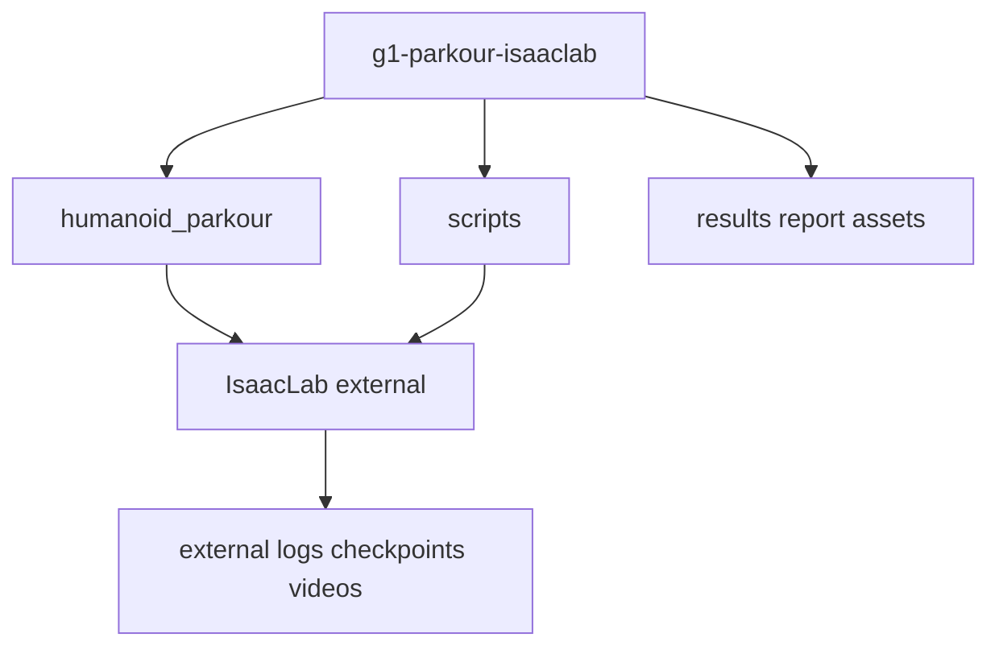

# Repository structure

Aligned with the delivery framework plan: path B, Isaac Lab as an external project, and this repository as a compact task/result/report package.

```text
g1-parkour-isaaclab/
├── README.md
├── README.zh.md
├── pyproject.toml
├── .gitignore
├── humanoid_parkour_course_project.md
├── humanoid_parkour/          # Installable package: tasks, terrains, evaluation, utilities
│   ├── tasks/g1_parkour/      # Env cfg, MDP overrides, Gym registration
│   ├── terrains/              # PARKOUR_*_TERRAINS_CFG
│   ├── evaluation/            # Metrics and success criteria helpers
│   └── utils/                 # Paths and task registry helpers
├── scripts/                   # Bash wrappers for train/play/eval workflows
├── configs/                   # Experiment and ablation notes in Markdown
├── results/                   # Commit-ready CSV files, figures, and Markdown tables
├── report/                    # Course report and selected rollout videos
└── docs/                      # Setup, training, and evaluation documentation
```

## Main workflow scripts

| Script | Purpose |
|--------|---------|
| `scripts/train_flat_baseline.sh` | Train the official flat G1 baseline |
| `scripts/train_rough_baseline.sh` | Train the official rough G1 baseline |
| `scripts/train_parkour.sh` | Train custom easy/medium/hard parkour tasks |
| `scripts/play_parkour.sh` | Play or record selected rollout videos |
| `scripts/eval_timeout_parkour.sh` | Diagonal fixed-checkpoint rollout evaluation |
| `scripts/eval_cross_terrain.sh` | Unified 4x4 random cross-terrain evaluation, controlled by `--metric timeout|progress|obstacle` |
| `scripts/eval_cross_terrain_stress.sh` | Unified 4x4 fixed-row stress evaluation, controlled by `--metric timeout|progress|obstacle` |
| `scripts/summarize_timeout_cross_terrain_eval.py` | Generate Markdown timeout cross/stress result tables |
| `scripts/summarize_traversal_progress_eval.py` | Generate Markdown traversal progress cross/stress result tables |
| `scripts/summarize_obstacle_crossing_eval.py` | Generate Markdown obstacle crossing cross/stress result tables |
| `scripts/launch_tensorboard.sh` | Launch TensorBoard for external run logs |

## Result artifacts

| Artifact type | Location |
|---------------|----------|
| Compact training/eval CSVs | `results/metrics/` |
| Generated Markdown tables | `results/tables/` |
| Report figures | `results/figures/` |
| Course report | `report/final_report.md` |
| Selected rollout videos | `report/assets/` |

## What stays outside Git

| Artifact | Typical location |
|----------|------------------|
| Checkpoints `*.pt` | `$HUMANOID_PARKOUR_RUNS_ROOT` |
| TensorBoard events | under external run logs |
| Raw training logs | `logs/`, `runs/`, `outputs/` |
| Raw/unselected videos | `$HUMANOID_PARKOUR_RUNS_ROOT/**/videos/` |

## Isaac Lab boundary

- **This repo**: task definitions, terrain presets, workflow scripts, compact results, report assets.
- **Isaac Lab**: `train.py`, `play.py`, simulator runtime, and official G1 baseline implementations.
- **Integration**: `pip install -e .` plus Gym registration in `tasks/g1_parkour/__init__.py`.


