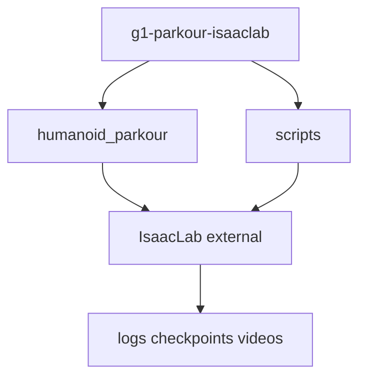

# Repository structure

Aligned with the delivery framework plan (path B, Isaac Lab external project).

```
g1-parkour-isaaclab/
├── README.md
├── pyproject.toml
├── .gitignore
├── humanoid_parkour_course_project.md
├── humanoid_parkour/          # Installable package — commit
│   ├── tasks/g1_parkour/      # Env cfg, MDP overrides, Gym register
│   ├── terrains/              # PARKOUR_*_TERRAINS_CFG only
│   ├── evaluation/            # Metrics & success criteria
│   └── utils/                 # paths, task registry
├── scripts/                   # Bash wrappers → Isaac Lab train/play
├── configs/                   # Experiment design (Markdown, not Python)
├── results/                   # Small CSV / figures / tables — commit
├── report/                    # Course report and selected rollout videos
└── docs/                      # How to use the repo
```

## What stays outside Git

| Artifact | Typical location |
|----------|------------------|
| Checkpoints `*.pt` | `$HUMANOID_PARKOUR_RUNS_ROOT` |
| TensorBoard events | under runs / logs |
| Raw training logs | `logs/`, `runs/`, `outputs/` |
| Raw/unselected videos | `$HUMANOID_PARKOUR_RUNS_ROOT/**/videos/` |

## Isaac Lab boundary

- **This repo**: task definition, terrain presets, scripts, results, report.
- **Isaac Lab**: `train.py`, `play.py`, sim runtime, official G1 baselines.
- **Integration**: `pip install -e .` + Gym registration in `tasks/g1_parkour/__init__.py`.


